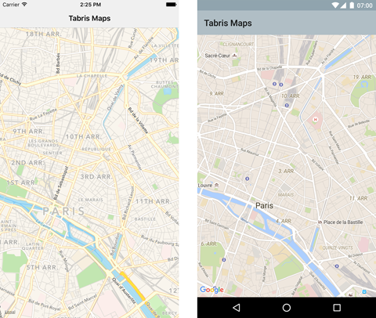

# Tabris.js Maps Plugin

The `tabris-plugin-maps` plugin project provides a [Tabris.js](https://tabrisjs.com) API to show and interact with a map widget. The plugin currently supports Android (via [Google Maps](https://developers.google.com/maps/)) and iOS (via [Map Kit](https://developer.apple.com/maps/)).



## Example

The following snippet shows how the `tabris-plugin-maps` plugin can be used in a Tabris.js app:

```javascript
new esmaps.Map({
  left: 0, right: 0, top: 0, bottom: 0
}).on('ready', function() {
  // show paris with a radius of 2000 meters
  this.moveToPosition([48.8644458, 2.3589976], 2000);
}).appendTo(tabris.ui.contentView);
```

A more elaborate example can be found in the [example](example/) folder. It provides a Tabris.js app that demonstrates various features of the `tabris-plugin-maps` widget.

## Integrating the plugin
The Tabris.js website provides detailed information on how to [integrate custom widgets](https://tabrisjs.com/documentation/latest/build#adding-plugins) in your Tabris.js based app.

### Add the plugin to your project

The plugin should be added as an entry in the apps `config.xml` file:

```xml
<plugin name="tabris-plugin-maps" spec="^4.0.0" />
```

To fetch the latest development version use the GitHub url:

```xml
<plugin name="tabris-plugin-maps" spec="https://github.com/eclipsesource/tabris-plugin-maps.git" />
```

#### Android

On Android a Google Maps API key has to be provided when adding the plugin to your Tabris.js app. The documentation for the Google Maps API explains how to [acquire an API key](https://developers.google.com/maps/documentation/android/signup).

The API key can be configured inside your app's `config.xml`:

```xml
<plugin name="tabris-plugin-maps" spec="^4.0.0">
  <variable name="ANDROID_API_KEY" value="$ANDROID_API_KEY" />
</plugin>
```

When the environment variable `ANDROID_API_KEY` is set, Tabris.js CLI will replace the value placeholder `$ANDROID_API_KEY` in the config.xml during build.

## API documentation

The API consists of two objects: The `esmaps.Map` and the `esmaps.Marker` that can be created on an `Map`. Note that the properties and functions of the `Map` *can only be accessed _after_ the [`ready`](#ready) callback has fired*.

### `Map`

#### Properties

The following properties can be applied on top of the [common Tabris.js properties](https://tabrisjs.com/documentation/latest/api/Widget#properties). All properties can be read and written unless noted otherwise.

##### `position` : _number[]_

* The current center position of the map. The array has to be a two element tuple consisting of latitude and longitude.
* Example: `[48.8644458, 2.3589976]`

##### `region` : _object_

* Describes the currently visible rectangle of the map. A region object has the two properties `southEast` and `northWest` that span the visible region of the map. In case the map is tilted the region is represented by the smallest possible rectangle that could contain the trapezoid representing the visible region.
* Example: `{southWest: [48.8644458, 2.3589976], northEast: [48.8821597,2.3856527]}`.

##### `camera` : _object_

* Represents the orientation of the camera. The camera currently only holds the one property `position`. It is the same property as the top level property `position`.
* Example: `{position: [48.8644458, 2.3589976]}`

##### `showMyLocation` : _boolean_, default: `false`

  * Displays the current location of the user on the map. To activate the option the app has to have the necessary permissions to retrieve the users location. Be aware that the position has to be obtained by the device so the effect might no be visible immediately.

##### `showMyLocationButton` : _boolean_, default: `false`

* Displays a button to animate the camera to the current location of the user when the location is available. Can only be activated when `showMyLocation` is enabled. The property is only available on Android but a similar effect can be achieved with the [`moveTo`](#functions) functions.

##### `myLocation` : _number[]_

* Retrieves the current location of the user. The returned array is a `position` array consisting of latitude and longitude. Can only be used when `showMyLocation` is enabled. Since the location obtained by `showMyLocation` is not available immediately this call can return `null` or `undefined`. The property is _read only_.
* Example: `[48.8644458, 2.3589976]`

##### `mapType` : _string_, supported values: `none`, `hybrid`, `normal`, `satellite`, `terrain`, `satelliteflyover`, `hybridflyover`, default: `normal`

* Defines how the map is visualized. The most common properties are `normal` and `sattelite`. Not all variants are supported on each platform. `hybrid`, `normal`, `satellite` are supported on Android and iOS whereas `none`, and `terrain` is only available on Android and `satelliteflyover` and `hybridflyover` is only available on iOS.

#### Events

##### `ready`

* The `ready` event is fired when the map is fully initialized and ready for user interaction. The [properties](#properties) and [functions](#functions) of the `Map` can only be accessed after the `ready` event has fired.

###### Event Parameters:

* `target` : _Map_
  * The `Map` widget that is ready

##### `tap`

* The `tap` event is fired when a tap on a map is detected.

###### Event Parameters:

* `target` : _Map_
  * The `Map` widget the tap occurred on
* `position` : _number[]_
  * A position array consisting of latitude and longitude: E.g. `[48.8644458, 2.3589976]`

##### `longpress`

* The `longpress` event is fired when a long press on a map is detected.

###### Event Parameters:

* `target` : _Map_
  * The `Map` widget the long press occurred on
* `position` : _number[]_
  * A position array consisting of latitude and longitude: E.g. `[48.8644458, 2.3589976]`

##### `cameraMoved`

* The `cameraMoved` event is fired when the user changed the position of the map by interacting with the map via touch. The callback is not guaranteed to fire continuously but rather when the map has reached a resting position.

###### Event Parameters:

* `target` : _Map_
  * The `Map` widget whose the camera position has changed
* `camera` : _object_
  * The `camera` object consists of the same properties as the [`camera`](#camera) property and contains the new orientation of the camera

##### `cameraChanged`

* The `cameraChanged` event is fired when the position of the map has reached its final destination by a programmatic camera change. E.g. by setting the [`position`](#position) or using one of the [`moveTo`](#functions) functions.

###### Event Parameters:

* `target` : _Map_
  * The `Map` widget whose the camera position has changed
* `camera` : _object_
  * The `camera` object consists of the same properties as the [`camera`](#camera) property and contains the new orientation of the camera


### Functions

#### `moveToPosition(position, radius, [options])`

The function `moveToPosition()` updates the cameras center to a new position and makes sure the given radius is fully contained in the visible region. This function resets the maps tilt.

Example:
```js
map.moveToPosition([48.8644458, 2.3589976], 500, {padding: 16, animate: true});
```
##### Parameter

* `position` : _number[]_
  * The target center [`position`](#position) of the map as an array of latitude and longitude. E.g. `[48.8644458, 2.3589976]`.
* `radius` : _number_
  * The radius in meters that should be visible on the map. Effectively this parameter controls the "zoom" level of the map.
* `options` : _object_
  * The optional options object contains additional information for the camera placement:
    * `padding` : _number_
      * A padding placed around the given `radius` in device independent pixel. This allows to give some inset to the region that we want to point the map to.
    * `animate` : _boolean_
      * Whether to place the camera directly at the given position or to move the camera in an animate fashion.

#### `moveToRegion(region, [options])`

The function `moveToPosition()` sets the cameras center to a new position and makes sure the given radius is fully contained in the visible region. This function resets the maps tilt.

Example:
```js
map.moveToRegion({southWest: [48.8644458, 2.3589976], northEast: [48.8821597,2.3856527]},
                 {padding: 16, animate: true});
```

##### Parameter

* `region` : _object_
  * The visible area to show on the map. The format of the region parameter is the same as for the [`region`](#region) property. It consists of two properties `southEast` and `northWest` to span the visible region of the map. E.g. `{southWest: [48.8644458, 2.3589976], northEast: [48.8821597,2.3856527]}`
* `options` : _object_
  * The optional options object contains additional information for the camera placement:
    * `padding` : _number_
      * A padding placed around the given `radius` in screen pixel. This allows to provide some inset to the region to be shown on the map.
    * `animate` : _boolean_
      * Whether to place the camera directly at the given position or to move the camera in an animated fashion.

#### `addMarker(marker)`

The function `addMarker(marker)` adds a marker to the map. When a map gets disposed all of its previously added markers are disposed with it.

#### `removeMarker(marker)`

The function `removeMarker(marker)` removes a marker from the map.

#### `getMarkers()`

The function `getMarkers()` returns an `array` of all currently added markers.

##### Parameter

* `options` : _Object_
  * Contains a property `latLng` to indicate the position of the marker.

### `Marker`

A `Marker` is used to indicate places and positions on the Map.

#### Properties

##### `position` : _number[]_

* The current position of the marker if set. The position is an array consisting of latitude and longitude: E.g. `[48.8644458, 2.3589976]`

##### `image` : _Image_

* Image to be shown instead of the standard marker image.

#### Events

##### `tap`

* The `tap` event is fired when the user taps on a marker.

#### Functions

##### dispose()

* Remove a marker from the map

## Compatibility

Compatible with [Tabris.js 2.2.0](https://github.com/eclipsesource/tabris-js/releases/tag/v2.2.0)

## Development of the widget

While not required by the consumer of the widget, this repository provides Android specific development artifacts. These artifacts allow to more easily consume the native source code when developing the native parts of the widget.

### Android

The project provides a gradle based build configuration, which also allows to import the project into Android Studio.

In order to reference the Tabris.js specific APIs, the environment variable `TABRIS_ANDROID_PLATFORM` has to point to the Tabris.js Android Cordova platform root directory.

```bash
export TABRIS_ANDROID_PLATFORM=/home/user/tabris-android
```
 The environment variable is consumed in the gradle projects [build.gradle](project/android/build.gradle) file.

## Copyright

Published under the terms of the [BSD 3-Clause License](LICENSE).
